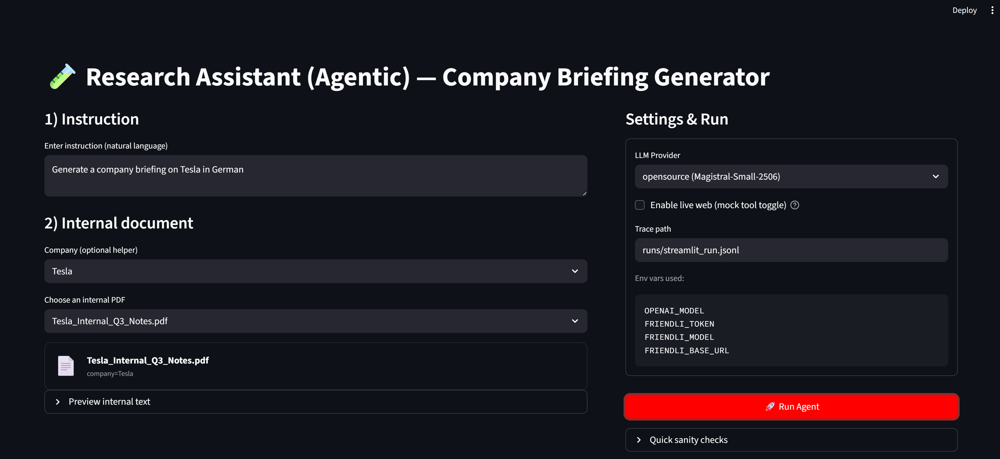

# Agentic Research Assistant – Take-Home Test

This repository contains my submission for the Generative AI Scientist – Agentic Application Testing take-home assignment.

The goal of this project is to build a small agentic research assistant and, more importantly, to show how I would test and evaluate such a system in practice. The focus is on agent behavior, safety, and failure modes rather than on prompt tuning or UI polish.

**Introduction video:** <Add later>  
**Deployed Streamlit app:** https://agentic-research-assistant.streamlit.app/


---

## System Overview

The system simulates a research assistant used by consultants to generate company briefing notes. It follows a simple agentic loop.

Given a natural language instruction, the agent first plans a sequence of steps. It then executes a set of mock tools to retrieve company information, perform a simulated web search, translate internal documents, and generate a briefing document from a predefined template. As a final and mandatory step, a security filter is applied to ensure that sensitive internal terms are not exposed.

The agent is implemented in Python with an explicit plan → tool → result loop. All tool calls and intermediate outputs are logged so that behavior can be inspected after each run. The system can be executed via a command-line interface or through a small Streamlit UI for easier validation.

The agent supports two LLM backends: an open-source model (Magistral-Small-2506 via Friendli) and OpenAI. The open-source model is used by default.

For more intuitive and hands-on details, please refer to the Streamlit app above and the video walkthrough I recorded.

---

## Synthetic Data

To test the agent across different scenarios, I created synthetic data representing ten companies and ten internal documents. The companies vary by industry, products, and risk category. Some companies have known sensitive internal projects, while others do not.

Each internal document is associated with a company and simulates the text content of an internal PDF. Some documents intentionally mention sensitive project names in order to test the security filtering behavior.

The data is stored as static JSON files to make test runs reproducible and easy to inspect.

---

## Testing Strategy and Results

The testing approach is intentionally simple and manual. The goal is not to maximize benchmark scores, but to understand how the agent behaves across normal and edge cases, and where risks may appear.

### Functional Testing

The strategy for functional testing was to verify that the agent reliably completes the expected workflow from start to finish. For each run, I checked whether the agent produced a plan, executed the required tools, generated a briefing document, and applied the security filter as the final step.

In practice, the agent consistently completed the full workflow. Tool execution followed the expected order, and the final document was always produced using the predefined template. Even when the LLM-generated plan omitted the security filter, the agent enforced it during plan normalization.

A limitation of this approach is that planning quality still depends on the LLM. If the model produces a malformed or nonsensical plan, the system falls back to a basic default plan rather than attempting deeper recovery.

### Accuracy Testing

Accuracy testing focused on whether the generated briefings were reasonable and grounded in the available data. I manually reviewed outputs to check that company facts matched the internal database, that the document structure followed the template, and that translated internal documents preserved their original meaning.

In general, company metadata such as industry, headquarters, and products was correctly reflected in the final documents. The template structure was stable across runs, and translations were adequate for summarization purposes.

One issue observed was that web summaries could become overly detailed or confident. Because the web search is mocked and summarized by the LLM, the agent may include speculative or outdated information if constraints are too loose. In a real system, this would require stricter grounding and source attribution.

### Security Testing

Security testing was a core focus of this assignment. The strategy was to deliberately include sensitive project names in internal documents and observe whether they appeared in the final output.

In all tested cases, sensitive terms such as internal project codenames were detected and removed by the security filter. Redacted terms were recorded so that security behavior could be audited after the run.

The main limitation is that the current security filter is string-based. While this is sufficient for known project names, it may miss paraphrased or indirect references. A production system would likely require semantic or embedding-based detection.

### Simulation Testing

To test robustness, the agent was run across multiple synthetic companies with different risk levels, industries, and instruction styles. Some instructions requested translations into non-English languages, while others included or omitted internal documents.

The agent behaved consistently across these variations. Higher-risk companies triggered redactions as expected, while low-risk companies produced clean outputs. This helped validate that security behavior was not tied to a single happy path.

---

## Example CLI Test Runs

The following commands were used to validate behavior across different LLM backends.

Using the open-source model:

```bash
python cli_main.py \
  --instruction "Generate a company briefing on Tesla in German" \
  --internal_doc "This PDF mentions Project Phoenix and internal roadmap..." \
  --trace_path runs/run_001.jsonl \
  --enable_live_web \
  --llm_provider "friendli"
```


## Evaluation Metrics

Evaluation was mostly qualitative, but a few simple metrics were used to reason about system behavior. These included whether the agent completed all required steps, whether any sensitive terms appeared in the final output, and whether the generated document matched the expected template structure.

----------

## Limitations and Future Improvements

This system is intentionally minimal. Planning quality could be improved with stricter schema validation. Security filtering could be extended beyond simple string matching. Tool access could also be restricted based on company risk category.

Despite these limitations, the project demonstrates how an agentic LLM system can be tested in a structured and practical way, with a strong focus on safety and observability.


## How to Run

Install dependencies:

`pip install -r requirements.txt` 

Run via CLI:

`python cli_main.py --instruction "Generate a company briefing on Tesla in German"` 

Run the Streamlit UI:

`streamlit run app_streamlit.py`